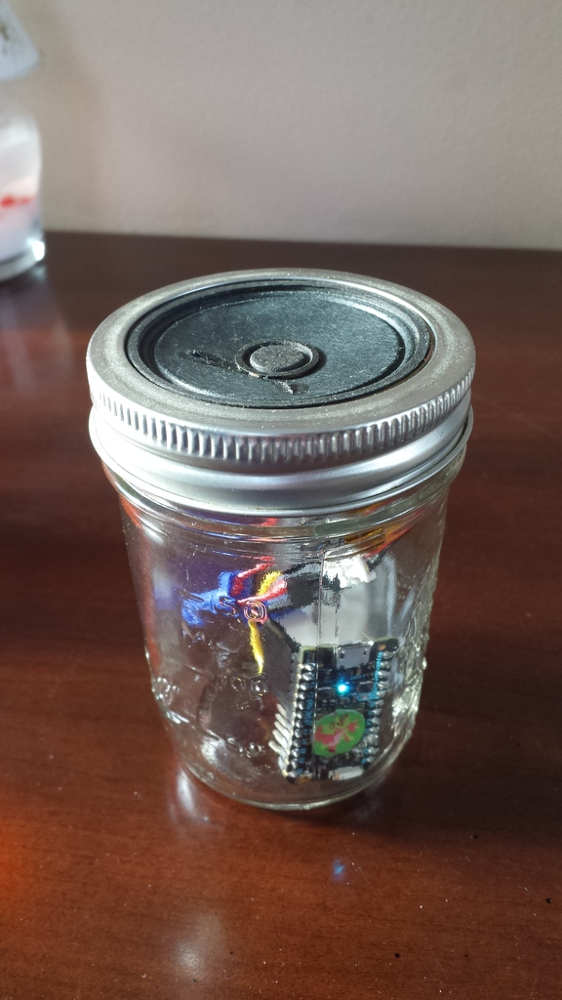

# LoFiBoomBox

I made a thing: it's a Particle Photon with an [audio amplifier](https://www.adafruit.com/products/2130) and small speaker. It plays music over a Wi-Fi connection.

It glitches when packets are dropped, freezes if the Wi-Fi gets
disconnected and sounds terrible. So go build one too!



Start the music server
```
cd Server
npm install
npm start
```

Update your laptop IP address in <Firmware/speaker_udp.cpp> and flash it
to your Photon.

```
particle flash <my_photon> Firmware
```


## License

Copyright 2016 Julien Vanier. Released under the MIT license
